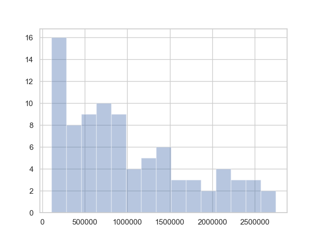
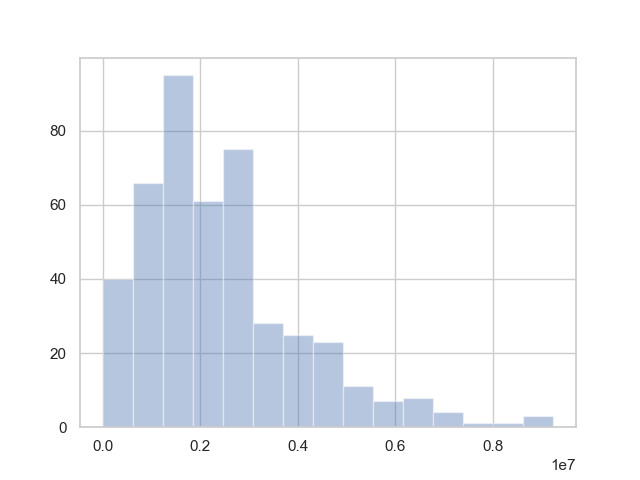
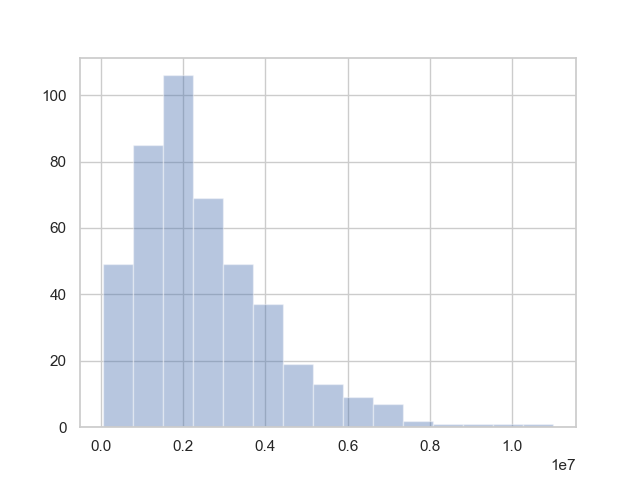
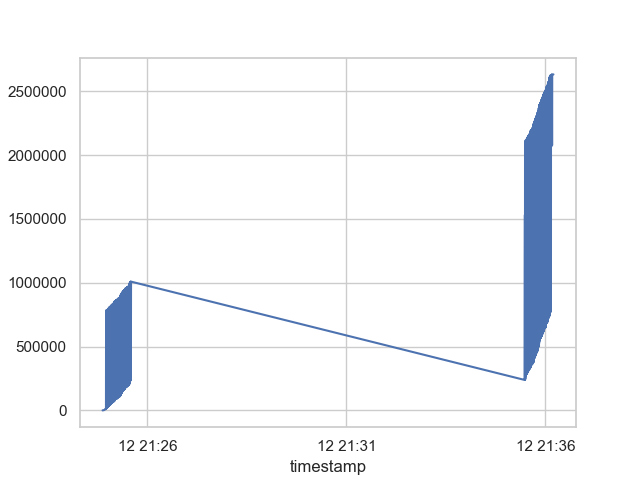

# cs425-spring19-mp2 Report

## Group

- mttsao2
- stoehr2 

## VM Cluster: 58

## Gitlab Repository

https://gitlab.engr.illinois.edu/mttsao2/cs425-sp19/tree/master/mp2

## How to Run the Code

1. Run the service `python36 mp2_service.py [SERVICE_PORT] [TX_RATE]`

2. Run our code: `python36 main.py [NUM_NODES_ON_THIS_VM] [SERVICE_IP] [SERVICE_PORT]`

e.g. `python36 main.py 2 sp19-cs425-g58-01.cs.illinois.edu 1111`

## Commit Hash

[I'm the commit hash]

## Design Document

### Node connectivity

At the appearnace of an "Introduce" command from the service, the ip and port will be added to the list of live addresses, `liveAddresses`. This is because we assume any command from the service is correct.

When "Introduce" messages are received from other nodes, they are placed onto the `unknownAddresses` list.

In order to reduce the amount of connection checking, we opted to use UDP broadcasts to send all of our messages. 

After each group of messages are sent to each mode, there is a 10ms timeout that waits for a REPLY message. If this is not received, then the node is assumed to be dead and its address is moved out of the pendingAddresses list into the deadAddresses list.

Please refer to:

```
{node.py}
class Node(Thread):
    ...
    def handleMessage(self, message, addr):
        ...
    def run(self):
        ...
        ## Clean up IP list section
        ...
```

### Transaction broadcast

Every round, each node picks up to three nodes from its `liveAddresses` list, and up to 2 nodes from the `unknownAddresses` list.

For each of these addresses (ip,port) pair, up to 5 transaction messages and 2 introduction messages are sent to each address. 

We simply send the original copy of the transaction or introduce message in order to reduce the amount of parsing and string manipulation.

In order to reduce the possibility of sending the same message over and over again, we have a dictionary that relates an address to a list of messages that have been sent, as well as a dictionary that relates a address to a list of messages that have been received. 

After the random choice of transaction and introduction messages, before anything is sent, each message and address are cross-referenced with these dictionaries to ensure we only send each message to another node only once. 

Please refer to:

```
{node.py}
class Node(Thread):
    ...
    def run(self):
        ...
        ## Figure out which addresses to send to
        ...
        ######## WRITE TO OTHER NODES
        ...
```

### Failure handling

If half of nodes fail, every round, in average, a node successfully sends recent transactions to 1.5 nodes. At round clog(n), the infected node number y ~ (n+1) - 1/n^(cb-2). Where n+1 is the total population of nodes. The situation with all nodes alive (b=3) and half nodes alive (b=1.5) is as follows:

| c   | b    | round  |formula of y      | ~y            |
| --- |:----:|:------:|:----------------:|--------------:|
| 1   | 3    | log(n) |(n+1)-1/n^(3-2)   | (n+1)-1/n     |
| 1   | 1.5  | log(n) |(n+1)-1/n^(1.5-2) | (n+1)-n^0.5   |
| 2   | 3    | 2log(n)|(n+1)-1/n^(6-2)   | (n+1)-1/n^4   |
| 2   | 1.5  | 2log(n)|(n+1)-1/n^(3-2)   | (n+1)-1/n     |
| 3   | 3    | 3log(n)|(n+1)-1/n^(9-2)   | (n+1)-1/n^7   |
| 3   | 1.5  | 3log(n)|(n+1)-1/n^(4.5-2) | (n+1)-1/n^2.5 |

The propagation time is roughly doubled when half nodes die in comparison to all nodes alive.

We handle node failures through our REPLY methodology. When a node sends a message but does not receive a REPLY from the destination node. This node's address is removed from the list of live or unknown nodes.

Because we only ever send one outbound INTRODUCE message for each known/recognized node, we will never send the same INTRODUCE message from one node to another after the initial INTRODUCE that was propogated throughout the nodes. 


### Node termination

By the definitions in the MP assignment page, our nodes will react to the QUIT and DIE commands by either exiting gracefully, or simply calling exit. 

Our main program iterates all of the nodes, waiting for them to shutdown, and completes when the ctrl-c buttons are pressed. 

If the nodes are killed by the service, by "thanos", or a regular command, there is either a socket closed which would lead to a socket.error, caught by the messageHandler, or the node simply declares itself dead and exits. 


### Blocks

`block.py` and `BlockManager.py` take care of most block activities.

We moved all of the block handling to a separate class in order to reduce the amount of variables in the node that relate to the current chain. 

Once a block is hashed, the BlockManager goes into a waiting state where all incoming Transaction Messages are deferred to the "pendingTransactions" list.

From here, two things can happen. First, a successful block can be returned by the service, which will kick off the creation of a new block, as well as creating a durable list of all committed blocks. After this, the block will be sent out once the node gets to the sending portion of its while loop

The other possibility is that of a new block coming in from a node. When this happens, the block levels of the current block in the BlockManager and the incoming block are compared. If they have the same level, the incoming block is discarded. If the new block has the same previous hash as the current block, the new block is accepted, added to the chain, and transactions from the node's current block are compared, discarding any that are found in the incoming block. If the new block has a higher level and a different previous hash, the BlockManager enters the "waitingForChain" phase. It holds an IP and Port that the node can access in order to pass on pieces of the chain that are received. 


###

## Analysis

### Transaction propagation completed

### Propagation Speed

- Propagation 50:

Plot 1: x = time elapsed for half of nodes receiving the transaction, y = count/freq, color = node #




- Propagation completed:

Plot 2: x = time elapsed for all nodes receiving the transaction, y = count/freq, color = node # 




- Transaction Propagation:

Nodes: 20

Plot 3: x = time, y = node # has received the transaction, color = transaction, nodes = 20


Nodes: 100

Plot 4: x = time, y = node # has received the transaction, color = transaction, nodes = 100


### Bandwidth

Nodes: 20

Plot 5: x = time, y = total bandwidth used, nodes = 20



Nodes: 100

Plot 6: x = time, y = total bandwidth used, nodes = 100


### How Long Does a Transaction appear in a Block

Plot 7: x = time elapsed for all nodes receiving the block, y = count/freq, node = 20


Plot 8: x = time elapsed for all nodes receiving the block, y = count/freq, node = 100


### Block Propagation Delay

Plot 9: x = time elapsed for all nodes receiving the block, y = count/freq, node = 20


Plot 10: x = time elapsed for all nodes receiving the block, y = count/freq, node = 100


### Splits

There were splits in our experiments.

The longest split we observered is
