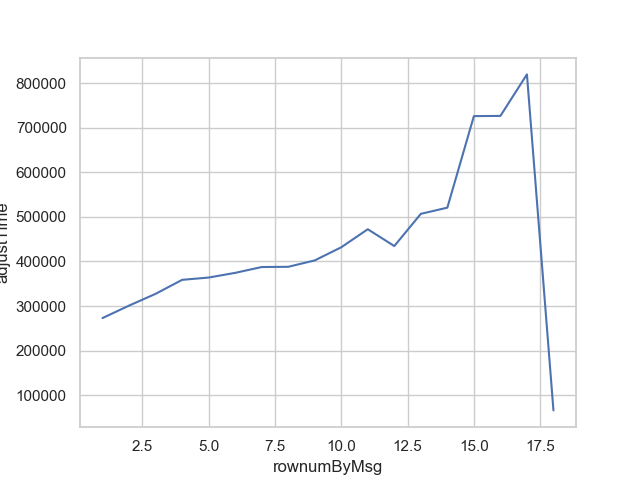

# cs425-spring19-mp2 Report

Please submit CP1 using Gradescope. Your submission should include the following information:

- The list of people in your group with names and NetIDs
- The URL to your GitLab repository. You must use the Engineering GitLab server and give the course staff Reporter access to your repository.
- Your group number
- A description of how to compile (if needed) and run your nodes

You should then have a description of the design of your MP2. Your description should explain:

- How your nodes keep connectivity; how they discover nodes beyond the originally introduced ones, and how they detect failed nodes. **You should justify why you think your design is robust to failures.**
- How transactions are propagated. Describe the algorithm you are using, any parameters and how you arrived at them.
- What information is logged and how you used this to generate the graphs. Please make sure that the logs you used in your experiments are checked into the git repository. If you wrote any scripts to analyze the logs please include them in the repo and describe how they work.

As a guideline, each of the three points above should be one or two paragraphs.

Finally, you should have the graphs of transaction propagation and bandwidth from the experiments described above.

## Group

- mttsao2
- stoehr2 

## VM Cluster: 58

## Gitlab Repository

https://gitlab.engr.illinois.edu/mttsao2/cs425-sp19/tree/master/mp2

## How to Run the Code

1. Run the service `python36 mp2_service.py [SERVICE_PORT] [TX_RATE]`

2. Run our code: `python36 main.py [NUM_NODES_ON_THIS_VM] [SERVICE_IP] [SERVICE_PORT]`

e.g. `python36 main.py 2 sp19-cs425-g58-01.cs.illinois.edu 1111`

## Commit Hash

[I'm the commit hash]

## Design Document

### Node connectivity

After the introduction of three existing nodes, the node adds these address to `unknown address list`. Every round, the node picks three to five nodes from its `live address list` and forward the following messages to these `live address` + all `unknown address`: 

1. 5 latest transactions
2. 3 address from `live address list`

Then the node adds these address to `pending address list` and wait for their responses. Once it got the reply, it adds the address to `live address list`.

Please refer to:

```
{node.py}
class Node(Thread):
    ...
    def handleMessage(self, message, addr):
        ...
    def run(self):
        ...
        ## NODE STUFF
        ...
```

### Transaction broadcast

Every round a node randomly chooses 3 nodes from the `live address list` and sends recent 5 transactions to them. 

Please refer to:

```
{node.py}
class Node(Thread):
    ...
    def run(self):
        ...
        ## Figure out which addresses to send to
        ...
        ######## WRITE TO OTHER NODES
        ...
```

### Failure handling

If half of nodes fail, every round, in average, a node successfully sends recent transactions to 1.5 nodes. At round clog(n), the infected node number y ~ (n+1) - 1/n^(cb-2). Where n+1 is the total population of nodes. The situation with all nodes alive (b=3) and half nodes alive (b=1.5) is as follows:

| c   | b    | round  |formula of y      | ~y            |
| --- |:----:|:------:|:----------------:|--------------:|
| 1   | 3    | log(n) |(n+1)-1/n^(3-2)   | (n+1)-1/n     |
| 1   | 1.5  | log(n) |(n+1)-1/n^(1.5-2) | (n+1)-n^0.5   |
| 2   | 3    | 2log(n)|(n+1)-1/n^(6-2)   | (n+1)-1/n^4   |
| 2   | 1.5  | 2log(n)|(n+1)-1/n^(3-2)   | (n+1)-1/n     |
| 3   | 3    | 3log(n)|(n+1)-1/n^(9-2)   | (n+1)-1/n^7   |
| 3   | 1.5  | 3log(n)|(n+1)-1/n^(4.5-2) | (n+1)-1/n^2.5 |

The propagation time is roughly doubled when half nodes die in comparison to all nodes alive.

### Node termination

Please refer to:

```
{node.py}
class Node(Thread):
    def handleServiceMessage(self, message):    
```

## Analysis

(Your CP1 report should include a graph of the propagation delay and bandwidth used by your system)
(20 nodes / 1tx per sec - 100 nodes / 20tx per sec)

We log 

| timestamp   | b    | round  |formula of y      | ~y            |
| --- |:----:|:------:|:----------------:|--------------:|
| 1   | 3    | log(n) |(n+1)-1/n^(3-2)   | (n+1)-1/n     |

### Transaction propagation completed

### Propagation Speed

- Propagation 50:


- Propagation completed:


- Transaction Propagation:

Nodes: 20


Nodes: 100



### Bandwidth

Nodes: 20


Nodes: 100


